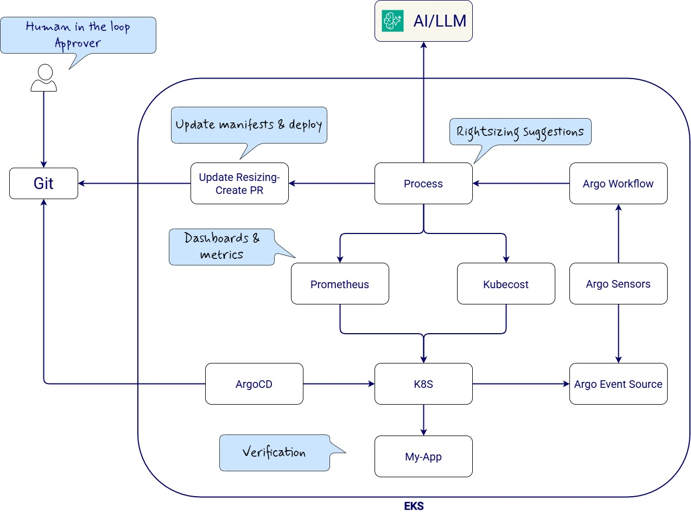
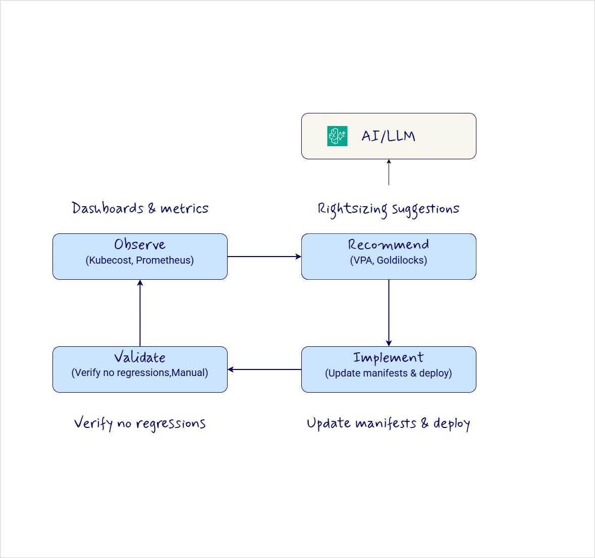

# AI-Powered Cost Optimization: From Insights to Autonomous Action with the Argo Ecosystem

From Visibility → Automated Action

FinOps in Kubernetes should work like GitOps.If the system can observe drift in performance or configuration, it should also be able to observe drift in cost efficiency, recommend a correction, apply that change through Git, and verify the result.

Most teams already have dashboards, metrics, and recommendations. They can see waste in Prometheus, Kubecost, or similar tooling, but the savings often stop at visibility. The real gap is not observation. It is execution. 

Attached workflow captures that well: Observe → Recommend → Implement → Validate, with tools like Kubecost and Prometheus feeding recommendations, VPA and Goldilocks supporting sizing guidance, and manifest updates flowing back into deployment after validation.

The core idea is simple: if GitOps transformed application delivery, the same model can be applied to cost optimization. Instead of treating FinOps as dashboards plus occasional cleanup, we can turn it into a closed-loop system that continuously analyzes usage, proposes safe changes, updates manifests, and validates outcomes before those changes become the new baseline. That is a much stronger model than relying on humans to remember rightsizing tasks every few weeks.

In most Kubernetes environments, overprovisioning is not a mistake. It is a defensive habit. Teams request for peak load, leave buffers in place, and rarely come back to tune them down. The result is familiar: low utilization, oversized requests, idle environments, forgotten namespaces, and persistent resources that outlive the workloads they were created for. The talk’s message was that this is not mainly a people problem; it is an automation problem.

## What makes the Argo-based approach interesting is that it closes the loop across multiple layers:

- Argo Workflows handles scheduled analysis and orchestration.
- Argo Events reacts to real-time triggers like new deployments, budget alerts, or namespace creation.
- Argo CD turns approved Git changes into actual cluster state.
- Argo Rollouts adds a safety net for progressive optimization and rollback.

## That stack gives cost optimization the same properties we already value in delivery pipelines: declarative changes, auditability, repeatability, and safety.

A practical pattern looks like this:

1. Observe cost and utilization signals from Prometheus and Kubecost.
2. Generate rightsizing or cleanup recommendations using AI.
3. Open a Git-based change, such as updated resource requests, cleanup actions, or policy changes.
4. Validate the impact before rollout, then promote or roll back based on the result.

## Here AI doesn’t replace this loop — it amplifies every stage:

- Observation→ Detect anomalies, trends, and hidden inefficiencies beyond static thresholds
- Recommendation→ Move from rule-based → context-aware & predictive rightsizing
- Decision (PRs)→ Auto-generate optimized configs, cleanup actions, policy updates
- Validation→ Compare pre/post metrics and decide promote vs rollback
- Learning Loop→ Continuously improve based on past optimizations

This is the shift I find most important:cost optimization is not only a finance exercise, it is a platform automation problem.

Now cost optimization becomes: 

✔ Declarative✔ Auditable✔ Repeatable✔ Safe✔ Adaptive
