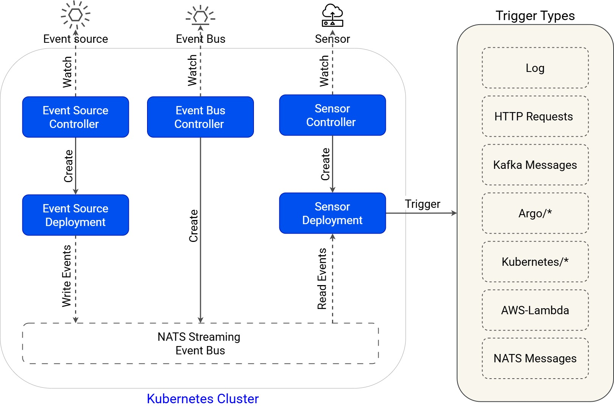

Argo Events is an event-driven workflow automation framework for Kubernetes which helps you trigger K8s objects, Argo Workflows, Serverless workloads, etc. on events from a variety of sources like webhooks, S3, schedules, messaging queues, gcp pubsub, sns, sqs, etc.

# Features
- Supports events from 20+ event sources.
- Ability to customize business-level constraint logic for workflow automation.
- Manage everything from simple, linear, real-time to complex, multi-source events.
- Supports Kubernetes Objects, Argo Workflow, AWS Lambda, Serverless, etc. as triggers.
- CloudEvents compliant.

# Triggers
- Argo Workflows
- Standard K8s Objects
- HTTP Requests / Serverless Workloads (OpenFaaS, - Kubeless, KNative etc.)
- AWS Lambda
- NATS Messages
- Kafka Messages
- Slack Notifications
- Azure Event Hubs Messages
- Argo Rollouts
- Custom Trigger / Build Your Own Trigger
- Apache OpenWhisk
- Log Trigger